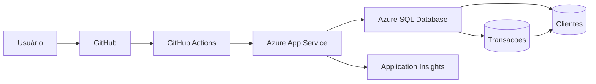

# Arquitetura da solução

## Visão macro

## Componentes

- **Frontend/Aplicação:** ASP.NET Core 8 Razor Pages.
- **Hospedagem:** Azure App Service.
- **Persistência:** Azure SQL Database.
- **ORM:** Entity Framework Core 8.
- **Monitoramento:** Application Insights.
- **CI/CD:** GitHub Actions.
- **Infraestrutura:** Azure CLI documentada em `scripts/`.

## Modelo de dados

`Cliente 1:N Transacao`

Um cliente pode possuir várias transações. Cada transação pertence a um cliente por meio da chave estrangeira `ClienteId`.
